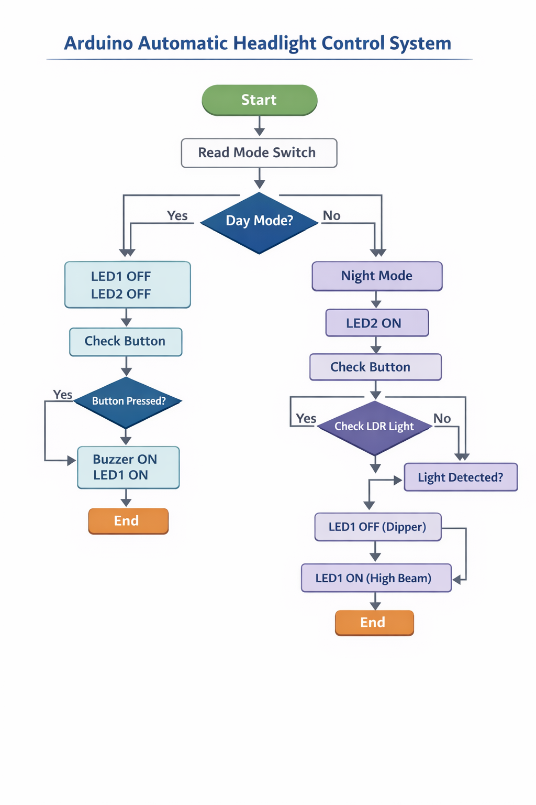
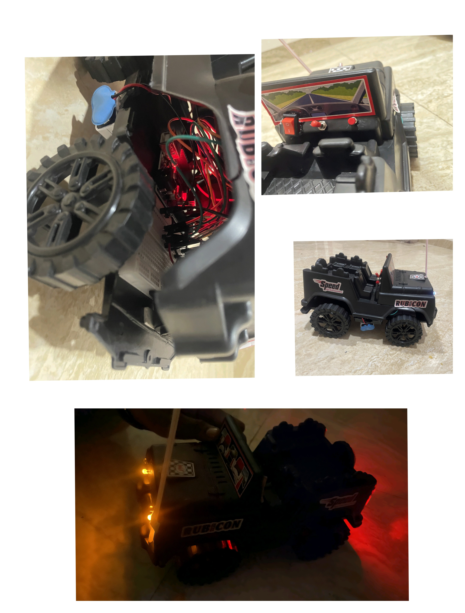

# Intelligent Headlight-Horn System
An Arduino-based intelligent system that automatically controls vehicle headlights using LDR for dipper functionality and includes a manual horn/overtake feature using a push button.

## Description
This project is an Arduino-based Intelligent Headlight and Horn System designed to improve driving safety. It automatically controls vehicle headlights using an LDR sensor to detect incoming light and switches between high and low beam (dipper). It also includes a manual horn and overtake feature using a push button.

---

## Features
- Automatic Day/Night mode using toggle switch
- Automatic dipper (high/low beam) using LDR
- Manual horn and overtake signal using push button
- Real-time response (no delay system)
- Clear indication using dual LEDs (High & Low beam)

---

## Components Used
- Arduino Uno
- LDR Sensor
- 2 LEDs (High beam & Low beam)
- Buzzer
- Push Button
- Toggle Switch
- Resistors
- Breadboard
- Connecting Wires
- Battery (Power Supply)

---

## Project Setup

The project is built using an Arduino Uno and basic electronic components on a breadboard. 

- Two LEDs are used to represent high beam (LED1) and low beam (LED2).
- An LDR sensor is used to detect incoming light from opposite vehicles.
- A push button is used for manual horn and overtake indication.
- A toggle switch is used to switch between day and night mode.
- A buzzer is used to simulate the vehicle horn.
- All components are connected using resistors, jumper wires, and a breadboard.
- The complete setup is mounted on a model car to simulate a real-world vehicle system.

---

## Working Process

1. Circuit is built using LEDs, LDR, buzzer, and button on a breadboard.
2. All components are connected to Arduino Uno.
3. The system is mounted on a car model for real-world simulation.
4. Battery is used to provide power and make the system portable.

---

## Working Modes

### Day Mode
- Headlights OFF
- Button press → Buzzer ON + Light ON
- Button release → OFF

---

### Night Mode
- LED2 (Low Beam) always ON
- LED1 ON → Normal condition (High Beam)
- LED1 OFF → When opposite light detected (Dipper)
- Button press → LED1 ON + Buzzer (Overtake)

---

## Flowchart

---

## Working Demo

---

## Conclusion
This system enhances road safety by automatically adjusting headlights based on surrounding light conditions and providing manual control for overtaking using a horn and high beam.

---

## Author
- Tushar dewangan
  
